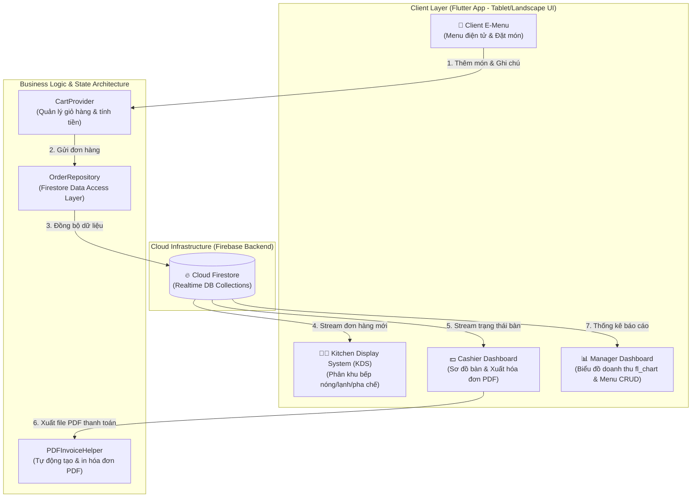

# 🍽️ Smart E-Menu Indochine — Full-Stack Real-Time Restaurant Management & Digital E-Menu System


> **Smart E-Menu Indochine** là giải pháp phần mềm đặt món ăn điện tử và quản lý nhà hàng toàn diện được thiết kế theo phong cách nghệ thuật Đông Dương (Indochine Elegance Style). Ứng dụng xây dựng trên nền tảng **Flutter** kết hợp **Firebase Cloud Firestore**, tối ưu hóa giao diện xoay ngang (Tablet/Landscape mode) nhằm kết nối thời gian thực giữa 4 vai trò vận hành cốt lõi: **Khách hàng (E-Menu)** ➔ **Nhà bếp (KDS)** ➔ **Thu ngân (Billing & PDF)** ➔ **Quản lý (Manager Dashboard)**.

---

## 🏛️ Kiến Trúc Hệ Thống & Luồng Dữ Liệu Real-Time (System Architecture)



---

## ✨ Tính Năng Nổi Bật Theo Vai Trò (Detailed Feature Breakdown)

### 📱 1. Khách Hàng (Digital E-Menu Station)
* **Thực đơn điện tử trực quan:** Phân loại món ăn theo danh mục (*Khai vị, Món chính, Món nướng, Tráng miệng, Đồ uống...*).
* **Tùy chỉnh ghi chú món ăn:** Cho phép ghi chú chi tiết đặc thù (*ít cay, không hành, thêm đá...*) ngay trên từng item.
* **Giỏ hàng Real-time:** Tự động tính toán tổng đơn hàng, phí dịch vụ, cập nhật biến động tức thì.
* **Gợi ý & Gọi dịch vụ:** Tích hợp nút gọi nhân viên hỗ trợ tại bàn trực tiếp đến màn hình thu ngân.

### 👨‍🍳 2. Nhà Bếp & Điều Phối (Kitchen Display System - KDS)
* **Nhận đơn tức thì:** Nhận tín hiệu đơn hàng mới ngay khi khách bấm đặt món nhờ cơ chế Firestore Stream.
* **Tự động phân khu bếp:** Tự động chia đơn về các phân khu chuyên trách (*Bếp nóng, Bếp lạnh, Pha chế, Nướng/Xào*).
* **Quy trình chế biến 1-Touch:** Chuyển trạng thái chế biến linh hoạt: `Chờ xử lý` ➔ `Đang chế biến` ➔ `Hoàn thành`.

### 💵 3. Thu Ngân & Quản Lý Sơ Đồ Bàn (Cashier & Billing Center)
* **Sơ đồ bàn trực quan:** Quản lý trạng thái thời gian thực của từng bàn (*Bàn trống, Đang dùng bữa, Chờ thanh toán*).
* **Áp dụng ưu đãi & Kiểm đơn:** Kiểm tra chi tiết đơn hàng, áp dụng mã giảm giá / voucher trước khi thanh toán.
* **Xuất & In Hóa Đơn PDF:** Tự động định dạng và render hóa đơn thanh toán PDF chuyên nghiệp với thư viện `pdf` và `printing`.
* **Tra cứu lịch sử:** Lưu trữ, tìm kiếm và xuất dữ liệu hóa đơn theo từng ngày hoặc ca làm việc.

### 📊 4. Quản Lý & Điều Hành (Manager Dashboard & Operations)
* **Biểu đồ doanh thu trực quan:** Biểu diễn doanh thu theo ngày, tuần, tháng bằng biểu đồ tương tác `fl_chart`.
* **Phân tích món bán chạy (Top Items):** Thống kê các món ăn có lượt gọi cao nhất để tối ưu nguyên liệu nhập kho.
* **Quản lý thực đơn toàn diện (CRUD):** Thêm món mới, cập nhật giá, chỉnh sửa danh mục hoặc bật/tắt trạng thái hết hàng.

---

## 🎨 Hệ Thống Thiết Kế Indochine Elegance (Design System)

Ứng dụng mang phong cách kiến trúc & mỹ thuật Đông Dương tinh tế:
* **Màu sắc chủ đạo:**
  - **Vàng Đồng Indochine (`#D4AF37`):** Điểm nhấn sang trọng cho nút bấm và tiêu đề.
  - **Xanh Rêu Đậm (`#2E4F4F` / `#0E2F2F`):** Tông nền thanh lịch, tạo cảm giác thư thái.
  - **Trắng Kem Nền (`#F9F6F0`):** Giúp chữ và hình ảnh món ăn nổi bật sắc nét.
* **Typography:** Kết hợp font chữ có chân cổ điển `Playfair Display` cho các tiêu đề chính và font không chân hiện đại cho thông tin chi tiết.

---

## 🛠️ Công Nghệ & Thư Viện Sử Dụng (Tech Stack)

| Hạng mục | Công nghệ / Package | Vai trò & Mục đích |
| :--- | :--- | :--- |
| **Core Framework** | **Flutter 3.x** (Dart SDK `>=3.0.0 <4.0.0`) | Nền tảng phát triển ứng dụng đa nền tảng, tối ưu Landscape |
| **Backend & Cloud** | **Firebase Core & Cloud Firestore** | Cơ sở dữ liệu NoSQL đám mây & đồng bộ thời gian thực |
| **State Management** | **Provider 6.x** | Quản lý trạng thái giỏ hàng & luồng dữ liệu ứng dụng |
| **Visualization** | **`fl_chart`** | Vẽ biểu đồ thống kê doanh thu và báo cáo |
| **Document Engine** | **`pdf` & `printing`** | Khởi tạo vector PDF và kết nối máy in hóa đơn |
| **Formatting** | **`intl`** | Định dạng tiền tệ (VND) và ngày tháng chuẩn Việt Nam |

---

## 📂 Cấu Trúc Thư Mục Dự Án (Project Structure)

```text
smart_emenu_indochine/
├── lib/
│   ├── core/
│   │   ├── constants/       # AppColors, AppStyles (Bảng màu & kiểu dáng UI)
│   │   └── utils/           # PdfInvoiceHelper, VietnameseMenuData, DummyDataGenerator
│   ├── models/              # FoodItem, OrderModel, TableModel, UserModel, CartItem
│   ├── providers/           # CartProvider (State Management cho giỏ hàng)
│   ├── screens/             # Các màn hình phân theo vai trò người dùng
│   │   ├── auth/            # Màn hình Login & Phân quyền
│   │   ├── cashier/         # CashierDashboard, TableDetailScreen, CashierHistory
│   │   ├── chef/            # ChefDashboard (Màn hình KDS điều phối bếp)
│   │   ├── e-menu/          # EmenuScreen (Giao diện tablet đặt món cho khách)
│   │   ├── manager/         # ManagerDashboard & MenuManagementScreen
│   │   └── welcome/         # WelcomeScreen (Màn hình khởi đầu)
│   ├── services/            # OrderRepository (Thao tác với Firebase Firestore)
│   └── widgets/             # Reusable UI (FoodCard, CartDialog, FoodDetailPanel...)
├── android/                 # Cấu hình Android native
├── ios/                     # Cấu hình iOS native
├── pubspec.yaml             # Khai báo phụ thuộc & metadata dự án
└── README.md                # Tài liệu hướng dẫn dự án
```

---

## 🚀 Hướng Dẫn Cài Đặt & Khởi Chạy (Getting Started)

### 📋 Yêu cầu tiên quyết
- **Flutter SDK** (Phiên bản `>= 3.0.0`).
- **Android Studio** hoặc **VS Code** (đã cài Flutter extension).
- Thiết bị thật hoặc Emulator hỗ trợ xoay ngang (Landscape Mode).

### 🔧 Các bước thực hiện

1. **Clone repository về máy cá nhân:**
   ```bash
   git clone https://github.com/ITLord28/Smart-EMenu-Indochine.git
   cd Smart-EMenu-Indochine
   ```

2. **Cài đặt các gói phụ thuộc (Dependencies):**
   ```bash
   flutter pub get
   ```

3. **Cấu hình Firebase (Tùy chọn):**
   - Dự án đã tích hợp sẵn cấu hình Firestore trong `lib/firebase_options.dart`.
   - Nếu dùng Firebase riêng, chạy lệnh:
     ```bash
     flutterfire configure
     ```

4. **Khởi chạy ứng dụng:**
   ```bash
   flutter run
   ```

---

## 🌟 Tóm Tắt Dự Án Để Đưa Vào CV / Portfolio (Resume Showcase)

> **Smart E-Menu Indochine — Full-Stack Real-Time Restaurant Management & E-Menu System**
> - **Mô tả:** Hệ thống quản lý nhà hàng & menu điện tử đa nền tảng tối ưu cho màn hình Tablet xoay ngang, kết nối thời gian thực giữa Khách hàng, Bếp, Thu ngân và Quản lý.
> - **Kỹ thuật nổi bật:** 
>   - Thiết kế kiến trúc đồng bộ dữ liệu Realtime sử dụng **Firebase Cloud Firestore Streams**.
>   - Quản lý trạng thái phản ứng (Reactive State) với **Provider Architecture**.
>   - Phát triển công cụ tự động Render & in Hóa đơn thanh toán định dạng PDF bằng **thư viện vector `pdf`/`printing`**.
>   - Trực quan hóa dữ liệu kinh doanh với **`fl_chart`**.
>   - Xây dựng **Indochine Elegance Design System** mang đậm tính thẩm mỹ cao cấp.

---

## 👥 Tác Giả & Đóng Góp (Credits & Contributors)

* 👨‍💻 **Huỳnh Tấn Phúc** ([@ITLord28](https://github.com/ITLord28)) — **Lead Developer & System Architect**
  - **Email:** `huynhtanphuc1312@gmail.com`
  - **Đơn vị:** Trường CNTT&TT — Đại học Cần Thơ (CTU)

* 👩‍💻 **Nguyễn Thị Ngọc Trân** — **Co-Developer & Contributor**
  - **MSSV:** B2303907
  - **Email:** `tranb2303907@student.ctu.edu.vn`
  - **Đơn vị:** Trường CNTT&TT — Đại học Cần Thơ (CTU)

---

## 📄 Giấy Phép (License)

Dự án này được phân phối dưới giấy phép **MIT License**. Bạn có thể tự do tham khảo, sử dụng hoặc phát triển thêm cho mục đích học tập và làm Portfolio cá nhân.
